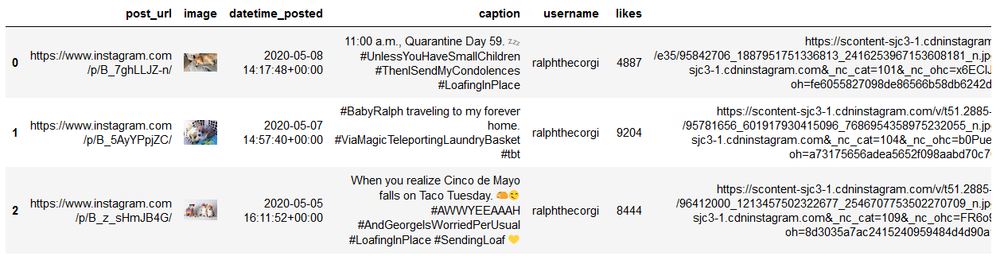

# Instagram WebScraper


## Summary

The Instragram Web Scraper uses Selenium and Requests to download
information on any number of posts from either a given hashtag or user. The scraper also handles retrieving Instagram user's information (followers, following)
as well. Information gathered for posts includes: username, hashtags, caption, date posted, and image url, 
aggregating all the data onto format of your choice (csv or parquet). In addition, the
scraper also downloads all the images for you.

## Requirements

This scraper uses Mozilla Firefox. To run the web scraper, Mozilla Firefox's geckodriver.exe must be in PATH

https://github.com/mozilla/geckodriver/releases

## Navigating the command line
Scraping posts:
```bash
python -m instagram_scraper --posts ralphthecorgi --number 9 --format csv
```
* `--posts`: hashtag or user posts to be scraped.
* `--number`: the nuber of posts to be scraped
* `--username`: optional username your your own Instagram account (credentials can also be in .env).
* `--password`: optional username your your own Instagram account (credentials can also be in .env).
* `--format`: output format. Defaults to "parquet". Can also be csv.

Scraping User account info:
```bash
python -m instagram_scraper --users ralphthecorgi maple.cat --format csv
```
* `--users`: single or multiple Instagram users account information to be scraped.
* `--username`: optional username your your own Instagram account (credentials can also be in .env).
* `--password`: optional username your your own Instagram account (credentials can also be in .env).
* `--format`: output format. Defaults to "parquet". Can also be csv.

## Credentials

Credentials can either be manually inputted in the commandline, or be in a .env file
```bash
# in .env
INSTA_USER=<yourusername>
INSTA_PASSWORD=<yourpassword>
```

## Posts() and Users()

Individual components used to make Instagram Web Scraper are every useful
for exploratory data analysis, especially in Jupyter Notebooks

```python
from instagram_scraper.scraper.posts import Posts, Users

post = Posts("ralphthecorgi", 5)
user = Users(["ralphthecorgi", "maple.cat"])
```

With the Posts object you can now natively access information that would have been written to file.
```python
post.image  # gives list of image objects
[<PIL.JpegImagePlugin.JpegImageFile image mode=RGB size=100x100 at 0x7EB6110508>,
 <PIL.JpegImagePlugin.JpegImageFile image mode=RGB size=88x100 at 0x7EC08B1148>,
 <PIL.JpegImagePlugin.JpegImageFile image mode=RGB size=100x83 at 0x7EC142AF48>,
 <PIL.JpegImagePlugin.JpegImageFile image mode=RGB size=100x100 at 0x7EC1436FC8>,
 <PIL.JpegImagePlugin.JpegImageFile image mode=RGB size=100x93 at 0x7EB6109CC8>]

post.likes  # gives list of likes
[4763, 10738, 8665, 7423, 7328]

user.followers  # gives list of number of followers
['321,926', '636,152']
```


DataFrame

```python
post.df  # collates all the information and returns a dataframe
```
In Jupyter Notebooks, `.html_df` can be used to show a DataFrame with the images inline
```python
post.html_df  # returns dataframe with images inline
```
<div align='center'>
    
</div>
